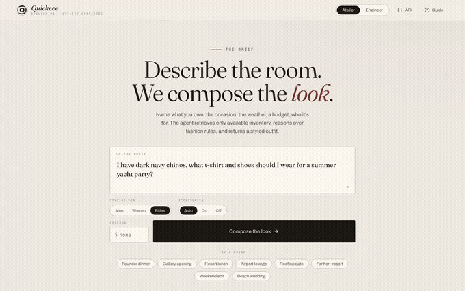
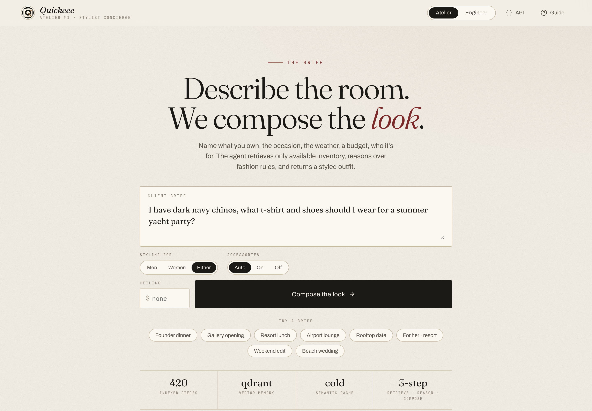
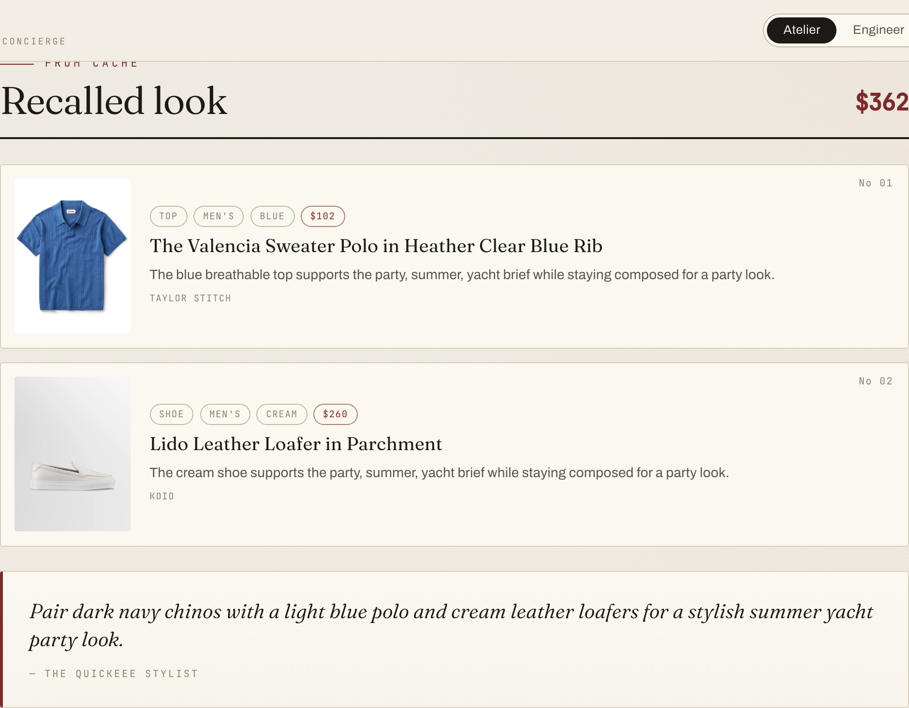
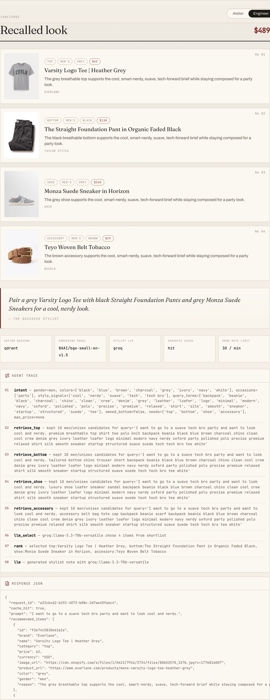

# Quickeee Luxury Stylist Concierge

An end-to-end Gen AI and data engineering assignment for a premium fashion concierge. The service scrapes apparel inventory, embeds the catalog, stores/searches it through a vector layer, and exposes a polished FastAPI + web console experience for outfit recommendations.

## Demo



▶️ **Full walkthrough (43s, MP4):** [`docs/demo/quickeee-walkthrough.mp4`](docs/demo/quickeee-walkthrough.mp4) — complex prompt → composed look → Engineer-mode agent trace + JSON, across three briefs with a gender switch.

## What It Does







- Live demo: `https://quickeee-luxury-stylist.onrender.com`
- Swagger/API docs: `https://quickeee-luxury-stylist.onrender.com/docs`
- Public repository: `https://github.com/RUiNtheExtinct/quickeee-luxury-stylist-concierge`

- Scrapes public apparel catalogs from four Shopify-backed fashion brands (Everlane, Taylor Stitch, Koio, Nisolo).
- Normalizes products into clean JSON: name, price, image URL, category, gender, description, color, material, source — using Shopify's structured color/material/gender signals instead of brittle free-text scanning.
- Indexes 420 curated products with FastEmbed/BGE vectors into Qdrant (payload indexes on category, color, gender, price) locally through Docker Compose, Qdrant Cloud, or a zero-service local vector fallback for free hosting.
- Runs a genuinely agentic styling workflow: gender/budget pre-filtered retrieval, fashion reranking, **LLM-driven outfit selection** (the model picks one coherent piece per category as strict JSON, honoring palette/gender/budget), semantic cache, rate limiting, and structured JSON output — with a deterministic fallback when no key is set.
- Serves an editorial-atelier concierge UI at `/` with default Atelier mode, reviewer-facing Engineer mode (trace, telemetry, raw JSON), lazy-loaded inventory preview, and a custom SVG/PNG brand mark.

## Fast Start

```bash
cp .env.example .env
uv venv --python 3.13 .venv
source .venv/bin/activate
uv pip install -e ".[dev,scrape]"
python scripts/generate_seed_catalog.py
uvicorn app.main:app --reload
```

Open:

- Concierge UI: `http://localhost:8000`
- Swagger API demo: `http://localhost:8000/docs`
- Health check: `http://localhost:8000/health`

## Docker Compose

```bash
cp .env.example .env
docker compose up --build
```

This runs:

- `api`: FastAPI app on port `8000`
- `qdrant`: local vector DB on port `6333`

## API Demo

```bash
curl -X POST http://localhost:8000/api/v1/style-me \
  -H "Content-Type: application/json" \
  -d '{
    "prompt": "I have dark navy chinos, what t-shirt and shoes should I wear for a summer yacht party?",
    "include_trace": true
  }'
```

Hosted API demo:

```bash
curl -X POST https://quickeee-luxury-stylist.onrender.com/api/v1/style-me \
  -H "Content-Type: application/json" \
  -d '{
    "prompt": "I have dark navy chinos, what t-shirt and shoes should I wear for a summer yacht party?",
    "include_trace": true
  }'
```

The response includes:

- `recommended_items`
- `total_price`
- `stylist_note`
- `token_strategy`
- `trace`
- `cache_hit`

## Scraping

```bash
python scripts/scrape_catalog.py --output data/catalog.live.json
```

The scraper targets:

- Everlane
- Taylor Stitch
- Koio
- Nisolo

It uses randomized user agents, polite jitter, normalized Shopify product feeds, HTML cleanup, category classification, structured gender/color/material extraction (with palette canonicalization), and an optional Playwright DOM fallback for JavaScript-heavy pages.

## Free Deployment Strategy

Default deploy path uses one Render web service with Qdrant Cloud free tier, local FastEmbed embeddings, and Groq for hosted stylist notes. The local JSON vector store and deterministic stylist remain as fallback modes for zero-key demos.

```env
EMBEDDING_PROVIDER=fastembed
EMBEDDING_MODEL=BAAI/bge-small-en-v1.5
EMBEDDING_DIMENSIONS=384
```

```env
VECTOR_BACKEND=qdrant
QDRANT_URL=https://your-cluster-url
QDRANT_API_KEY=your-key
QDRANT_COLLECTION=quickeee_catalog
QDRANT_RECREATE_ON_STARTUP=false
```

The hosted model uses Groq's OpenAI-compatible API:

```env
LLM_PROVIDER=groq
LLM_API_KEY=your-key
LLM_BASE_URL=https://api.groq.com/openai/v1
LLM_MODEL=llama-3.3-70b-versatile
```

## Repository Structure

```text
app/
  agent.py          # intent, retrieval, reranking, note generation
  cache.py          # semantic cache for repeated/similar prompts
  catalog.py        # catalog loading and category counts
  config.py         # environment settings
  embeddings.py     # FastEmbed BGE embeddings plus hashing fallback
  main.py           # FastAPI app and routes
  models.py         # Pydantic request/response/catalog models
  vector_store.py   # Qdrant and local JSON vector implementations
  static/           # concierge UI, logo, favicons, vendored icons
data/
  catalog.seed.json # checked-in demo catalog, 420 tops/bottoms/shoes/accessories with gender
  catalog.scraped.sample.json # scraper output sample from public apparel sites
scripts/
  generate_seed_catalog.py
  scrape_catalog.py
tests/
```

## Submission Checklist

- Public GitHub repository
- `ARCHITECTURE.md`
- `SYSTEM_FLOW.md`
- Demo walkthrough: inline GIF preview above, plus full [`docs/demo/quickeee-walkthrough.mp4`](docs/demo/quickeee-walkthrough.mp4) — complex prompt → composed look → Engineer-mode agent trace + JSON
- API endpoint demo: `POST /api/v1/style-me`
