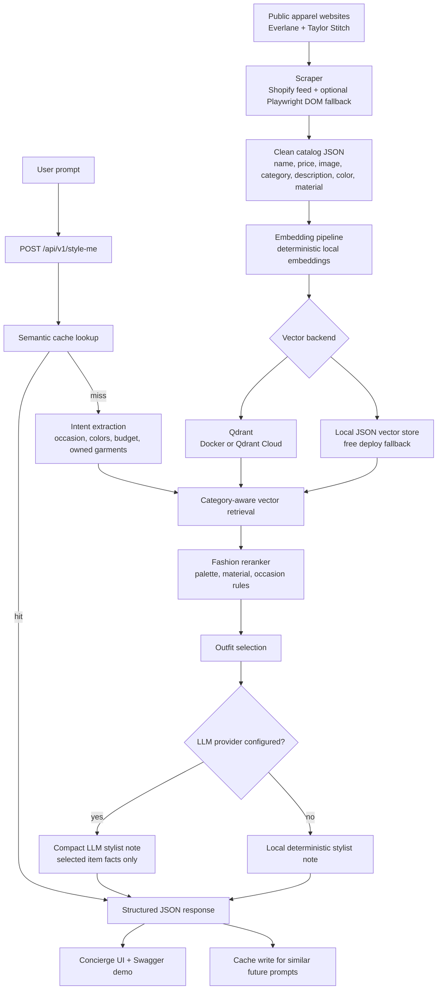

# System Flow



## Demo Path

1. Start the app.
2. Open `/` for the concierge UI or `/docs` for Swagger.
3. Submit:

```text
I have dark navy chinos, what t-shirt and shoes should I wear for a summer yacht party?
```

4. Show returned items, total price, stylist note, and trace.
5. Submit the same or similar prompt again to show `cache_hit: true`.
